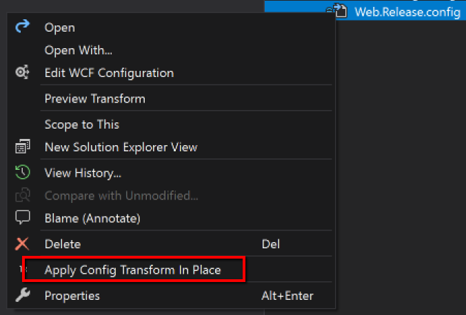

# ApplyConfigTransformInPlace

Provides a quick, no frills, way to apply any Web or App transform to its respective parent in place.  This tool is meant to speed local development.

Note: This tool will work for any transform that matches the regex ["([\w]+\.)[\w-]+\.config"](https://regex101.com/r/oqNyED/1) Provided that the transform and the calculated destination are in the same folder path.

example transform names:
- web.debug.config
- saml.dev-1.config
- app.test_env1.config

How it works:
1. Right click on a transform (ex: Web.Release.config).
2. Click 'Apply Config Transform In Place'
3.  The Visual Studio Extension finds the relative Web.config in the same directory and applies the transform.

# Versions

1.1.0.1:
- able to work for any transform that matches the regex ["([\w]+\.)[\w-]+\.config"](https://regex101.com/r/oqNyED/1)
